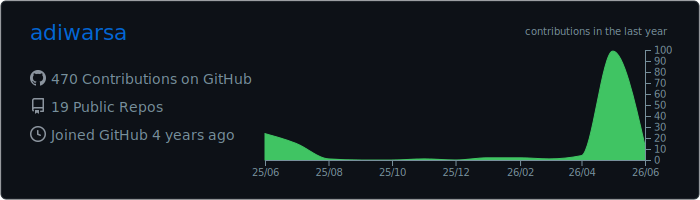
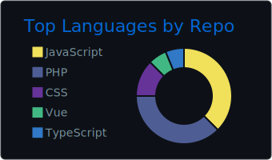
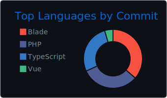
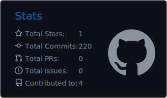
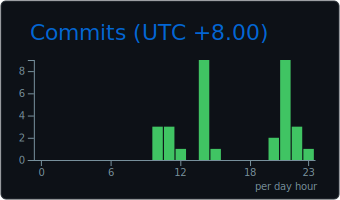

<h1 align="center">
  
</h1>

<h3 align="center">Software Engineer from Bali</h3>

 

Working as a <strong>Full Stack Developer</strong>
Building web apps that feel good in real use, with clean UI, fast load times, accessible details, and code that future-me can still enjoy

Mostly working with <strong>Laravel, Livewire, Inertia, Go, React, Next.js, Node.js, Vue, and TypeScript</strong>

Open to collaborations, freelance work, and thoughtful product ideas

 

  
  
  
  

<h2 align="center">Tools</h2>
 

  
  
  
  
  
  

 

<h2 align="center">Frameworks & Libraries</h2>
 

  
  
  
  
  
  
  
  
    
  
  

 

<h2 align="center">Languages</h2>
 

  
  
  
  
  
  

 

<h2 align="center">Databases</h2>
 

  
  
  

 

<h2 align="center">Version Control Systems (VCS)</h2>
 

  
  

 

  <h2>My Contributions</h2>
   
  
    

<h2 align="center">Stats</h2>
 

  
    
  
    
  
  
    
  
  

